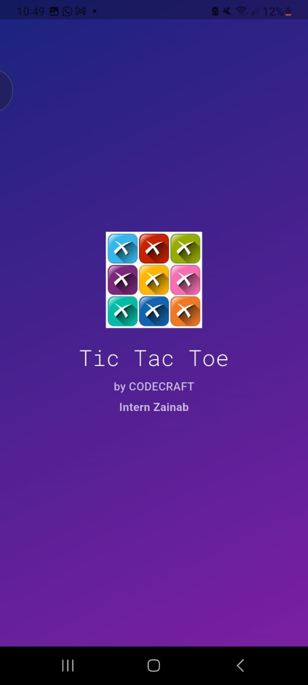

# CODECRAFT-AD-04
Very interesting Development of a Game TIC TAC TOE , Mine fav one 
# 🎮 Tic Tac Toe Game App — CodeCraft Internship Task

This Flutter app is a **Tic Tac Toe game** developed as part of my internship task at **CodeCraft**. It allows **two players** to play the classic game on a 3x3 grid, taking turns to mark their symbol (❌ or ⭕) until one wins or the game ends in a draw.

---

## 🚀 Features

- 👥 Two-player game mode
- 🔁 Reset option to start a new game
- ✅ Win detection for horizontal, vertical, or diagonal patterns
- 📱 Responsive, user-friendly UI with Material Design
- 🎨 Modern visuals using Flutter widgets

---

## 🧰 Technologies Used

| Tool        | Purpose                        |
| ----------- | ------------------------------ |
| `Flutter`   | Cross-platform mobile framework |
| `Dart`      | Programming language            |
| `Material`  | UI widgets and design system    |

---

## 📸 Screenshots 

| Splash screen       | Draw Game     |
| ----------------- | ------------------- |
|  |  |

---

## 🔍 How It Works

1. Players take turns tapping an empty cell to place their mark (X or O).
2. The app checks after each move if any player has won.
3. If a player wins, a dialog shows the result.
4. If all 9 cells are filled without a winner, it's a draw.
5. Press the **Reset** button to start a new game.

